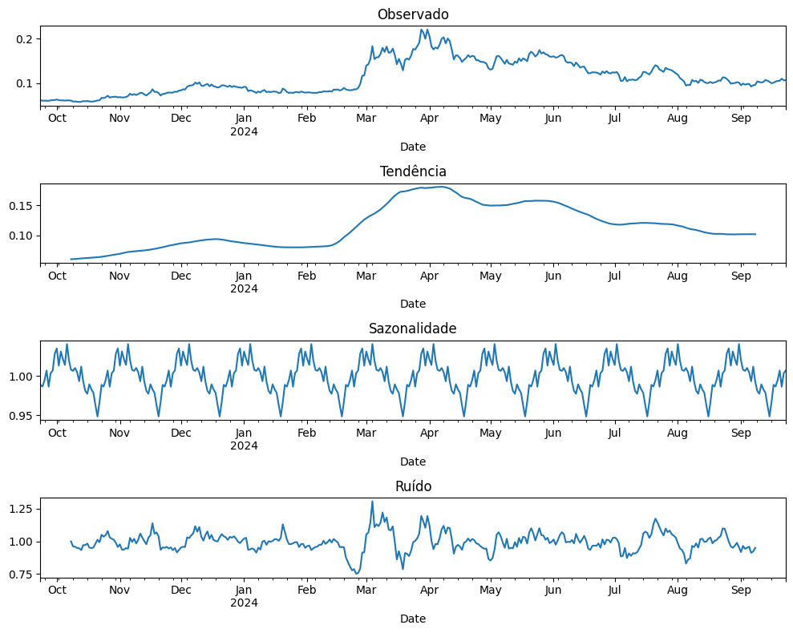

# Atividade Ponderada - Módulo 07

&emsp;&emsp;Neste Readme, é possível ver toda a documentação desta atividade ponderada. Há mais informações que foram documentadas no notebook deste repositório, mas de qualquer maneira, este Readme foi feito da maneira mais completa possível, para justificar tudo que foi feito nesta atividade.

## Objetivo

&emsp;&emsp;O objetivo da atividade é construir um sistema de auxílio à tomada de decisões para investimento em cripto ativos. O sistema deve ser capaz de analisar o histórico de preços de cripto ativos e indicar o melhor momento para compra e venda de ativos. Essa construção deve ser realizada utilizando modelos de machine learning

## Exploração dos dados

&emsp;&emsp;Para esta atividade, foram escolhidas duas moedas cripto ativas, o bitcoin e a dogecoin. O bitcoin é sem dúvidas a criptomoeda mais famosa do mundo, e atualmente vale em torno dos 63 mil dólares. Já a dogecoin é uma moeda de bem menos valor, em torno dos 10 centavos americanos, e foi criada inicialmente como uma "moeda piada", mas que hoje é relativamente conhecida e possui um histórico de preços interessante de se estudar. Além disso, pode ser interessante comparar moedas com preços de ação distantes entre sí, para ver se o comportamento histórico dos preços seguem um padrão similar ou não.

&emsp;&emsp;Ao importar os dados históricos de ambas as moedas, foram escolhidos os dados referentes aos últimos 365 dias, para que eles, posteriormente, fossem utilizados para a exploração dos dados e para o treinamento do modelo

&emsp;&emsp;Para analisar o preço de fechamento de cada ação, foram selecionados os dados da coluna 'Close', que são justamente os dados de fechamento da ação. A seguir, é possível ver um gráfico do preço de fechamento da ação do Bitcoin nos últimos 365 dias:

&emsp;&emsp;O grafico acima mostra que houve um crescimento relevante da ação do Bitcoin em relação ao ano passado. Entre outubro de 2023 e março de 2024, o valor foi de 25 mil para mais de 70 mil dolares. Após atingir o seu maior valor em março, os preços começaram a ocilar bastante, tanto pra cima quanto pra baixo, mas é possível considerar que desde março até setembro deste ano houve uma pequena queda no preço da ação

&emsp;&emsp;Há outros gráficos temporais que podem ser relevantes para esta exploração dos dados, como o gráfico observado, o de tendência, o de sazonalidade e o de ruído

&emsp;&emsp;Ao seguir uma série temporal, os quatro gráficos acima demonstram de forma detalhada o histórico de preços deste último ano, mostrando informações que foram imperceptiveis no primeiro gráfico. O gráfico observado e o de tendência demonstram informações que já eram perceptíveis no primeiro gráfico, ao seguir uma linha semelhante ao que já tinha sido apresentado. Já o gráfico de sazonalidade mostra novas informações, quanto ao comportamento repetitivo que ocorre em determinados períodos, e o gráfico de ruído tenta mostrar de uma outra forma esse comportamento repetitivo, mas tentando ignorar o efeito da sazonalidade

&emsp;&emsp;Os mesmos gráficos para o estudo dos dados do Bitcoin foram feitos para estudar a criptomoeda Dogecoin:

&emsp;&emsp;Neste gráfico, também é possísel ver que houve um aumento no preço da ação por volta de março de 2024, assim como ocorreu com o Bitcoin. Isso pode ser ocorrido por conta de uma série de fatores internos e externos, como por exemplo, um "hype" nas criptomoedas, mas é necessário estudar bastante o mercado para realmente entender o motivo dessas mudanças. Ainda assim, é interessante ver este aumento no preço destas duas ações, mesmo tendo valores extremamente distantes entre si.

&emsp;&emsp;Os gráficos temporais mostram linhas semelhantes aos gráficos do Bitcoin, principalmente o gráfico observado e o de tendência. É interessante observar a sazonalidade, pois ela segue um padrão em que todo mês e extremamente semelhante ao outro.

## Modelo

&emsp;&emsp;Após toda essa análise dos dados, a hora de implementar o modelo preditivo chegou! 

&emsp;&emsp;A partir de toda a exploração dos dados, o modelo de machine learning escolhido foi o LSTM (Long Short Term Memory). Este modelo é um tipo de rede neural recorrente, que é usada em diversps cenários de processamento de Linguagem Natural.

&emsp;&emsp;A arquitetura da rede neural reccorente da LSTM é capaz de "lembrar" valores em intervalos arbitrários, o que a torna adequada para classificar, processas e prever séries temporais com intervalos de tempo de duração desconhecida. Por conta destas características, este modelo se torna ideal para realizar as predições de valores futuros de criptomoedas perante o histórico de preços antigos, e consequentemente indicar o melhor momento de compra e de venda delas.

&emsp;&emsp;Dessa forma, o modelo LSTM foi implementado para realizar a predição dos preços nos próximos 100 dias, e dizer em qual desses dias será o melhor para comprar ou vender a moeda. Esta lógica inteira pode ser vista no notebook deste repositório, mas os resultados podem ser vistos no seguinte gráfico:

&emsp;&emsp;As predições mostram que o preço deve aumentar, até um certo momento em que ele começa a cair lentamente. Ou seja, o melhor momento para se comprar a moeda é no dia 20/09 (primeiro dia da predição), com o valor de 63 mil dólares e para se vender no dia 26/10, com o valor de 67 mil dólares

&emsp;&emsp;Para prever o preço da Dogecoin, a mesma lógica foi utilizada:

&emsp;&emsp;Este resultado mostra que a moeda deve aumentar de preço de forma relevante até a metade de outubro, em que ela começa a subir de forma mais lenta. Assim, o melhor momento para se comprar a moeda é no dia 20/09, com o valor de 11 centávos americanos e para se vender no dia 28/12, com o valor de 16 centavos americanos

## API

&emsp;&emsp;Para a exibição de todo o projeto feito a partir dos dados gerados no notebook, foi criado uma API, em que fosse possível gerar predições, treinar o modelo com novos dados e exibir os resultados por meio de gráficos

&emsp;&emsp;Esta API foi feita utilizando TypeScripts, Tailwind e React. O backend foi feito utilizando Postgres e Docker

## Dashboard

&emsp;&emsp;Para interagir com o modelo e visualizar os cenários conforme a predição dos modelos, foi criada uma dashboard nesta API. Ela pode ser vista na rota /dashboard, e nesta rota exibe uma imagem com a predição feita pelo modelo

## Logs

&emsp;&emsp;Para acessar o sistema de logs da atividade, é preciso acessar a seguinte rota: http://localhost:8000/logs